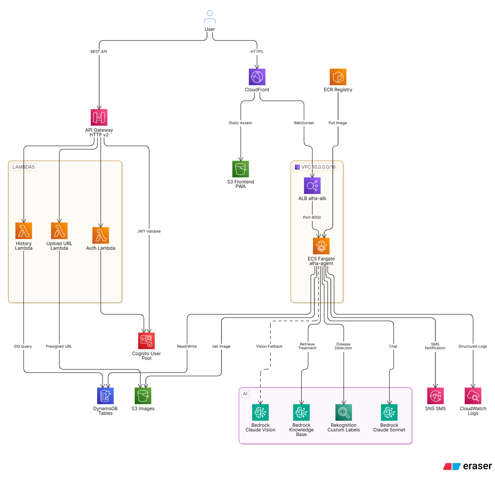
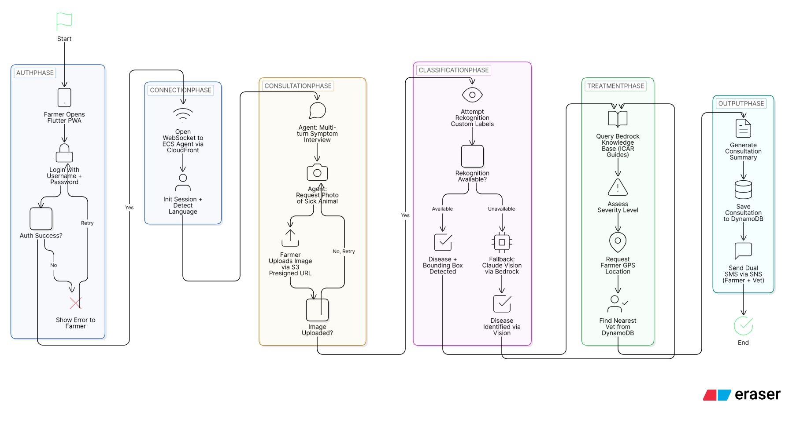

# ALHA — AI Livestock Health Assistant

> **Bilingual (Hindi/English) AI-powered veterinary consultation system for Indian farmers.**
> Built for farmers — chat, voice, image, GPS, and SMS in under 90 seconds.

---

## Architecture



---

## Problem Statement

Indian farmers — particularly smallholders in rural areas — often lack timely access to licensed veterinarians. Livestock diseases can spread rapidly, causing significant economic loss. Language barriers (Hindi vs. English) and low digital literacy further limit access to veterinary information.

---

## Solution

A Progressive Web App (PWA) accessible on any mobile browser, backed by a Claude AI agent that:

1. Conducts a structured symptom interview in the farmer's language
2. Requests and analyzes a photo of the affected animal
3. Classifies the disease using ML (Rekognition + Claude vision)
4. Retrieves evidence-based treatment from a veterinary knowledge base (ICAR/NDDB)
5. Assesses severity and coordinates with the nearest available vet via GPS + SMS

---

## Consultation Flow



---

## Key Features

| Feature | Description |
|---------|-------------|
| **Bilingual AI chat** | Auto-detects Hindi (Devanagari) or English. Strict language consistency per session. |
| **Voice input** | Speech-to-text in `hi_IN` / `en_US` via Web Speech API |
| **Structured symptom interview** | Claude generates targeted questions; farmer answers via an overlay form |
| **Image-based disease diagnosis** | Camera/gallery upload → AWS Rekognition Custom Labels + Claude vision double-check |
| **Bounding box visualization** | Highlights affected area on the uploaded photo |
| **Veterinary knowledge base** | Retrieves treatment protocols from ICAR/NDDB documents (Amazon Bedrock KB) |
| **Severity classification** | CRITICAL / HIGH / MEDIUM / LOW / NONE with color-coded badge |
| **GPS-based vet location** | Haversine nearest-vet search filtered by animal speciality |
| **SMS notifications** | Dual SMS via AWS SNS: farmer gets vet confirmation, vet gets location + case details |
| **Vet preference card** | For HIGH/MEDIUM severity, farmer chooses whether to contact the vet |
| **Consultation history** | Past consultations retrievable with treatment summary and KB citations |
| **Offline detection** | Bilingual offline screen on connectivity loss |
| **Medical disclaimer** | Mandatory disclaimer appended to every clinical response |

---

## Supported Diseases

| Disease | Hindi Name | Severity |
|---------|-----------|----------|
| `lumpy_skin_disease` | लम्पी स्किन रोग | CRITICAL |
| `newcastle_disease` | रानीखेत रोग | CRITICAL |
| `anthrax` | एंथ्रेक्स (तिल्ली ज्वर) | CRITICAL |
| `foot_and_mouth_disease` | खुरपका-मुंहपका रोग | HIGH |
| `brucellosis` | ब्रुसेलोसिस | HIGH |
| `blackleg` | काला पांव | HIGH |
| Any other known disease | — | MEDIUM |
| Routine/preventive query | — | LOW |

---

## Monorepo Structure

```
ALHA/
├── alha/                  ← Flutter PWA (web target)
│   └── lib/
│       ├── config/        ← App config, theme
│       ├── models/        ← Message, Consultation, Vet, WsMessage
│       ├── providers/     ← session, chat, camera (Riverpod)
│       ├── screens/       ← Chat, Login, History, Profile
│       ├── services/      ← WebSocket, Auth, Upload, Speech, Location
│       └── widgets/       ← TextBubble, ImageBubble, SeverityBadge, VetCard, overlays
│
├── alha-agent/            ← Claude Agent SDK service (ECS Fargate)
│   ├── app.py             ← FastAPI app, WebSocket endpoint, REST endpoints
│   ├── agent.py           ← Claude Agent SDK query loop + MCP server
│   ├── config.py          ← Environment variable config
│   ├── ws_map.py          ← Shared session→WebSocket map for tools
│   ├── hooks/             ← LoggingHook, PIIFilterHook
│   ├── models/            ← Consultation, Vet, WsMessages (Pydantic)
│   ├── tools/             ← 9 MCP tools (symptom_interview, classify_disease, ...)
│   ├── utils/             ← haversine, dynamo_helpers
│   └── prompts/           ← system_prompt.txt
│
├── alha-backend/          ← AWS SAM infrastructure + Lambda stubs
│   ├── template.yaml      ← Full AWS infrastructure definition
│   ├── functions/
│   │   ├── image_validator/       ← Lambda: POST /api/upload-url
│   │   ├── notification_handler/  ← Lambda: GET /api/history + POST /api/auth/login
│   │   └── disease_classifier/    ← Lambda stub (classification done in agent)
│   └── scripts/           ← seed_vets.py, create_demo_users.py, warm_rekognition.py
│
├── docs/                  ← Project documentation
├── .env                   ← Environment variables (not committed)
└── .env.example           ← Template for .env
```

---

## Technology Stack

### Flutter PWA (`alha/`)

| Category | Technology | Notes |
|----------|-----------|-------|
| Language | Dart >=3.0.0 | |
| Framework | Flutter 3.x | Web (PWA) target |
| State Management | flutter_riverpod ^2.4.0 | `StateNotifierProvider` pattern |
| HTTP Client | http ^1.2.0 | REST calls to API Gateway |
| WebSocket | web_socket_channel ^2.4.0 | Persistent connection to agent |
| Speech-to-Text | speech_to_text ^6.6.0 | Bilingual: `en_US` / `hi_IN` |
| Image Capture | image_picker ^1.0.0 | Camera + gallery (web FileInput) |
| Markdown | flutter_markdown ^0.7.3 | Agent response rendering |
| Theme | Material 3 | Seed: `#2E7D32` (forest green), background: `#F9F6F0` |

### Claude Agent Service (`alha-agent/`)

| Category | Technology | Notes |
|----------|-----------|-------|
| Language | Python 3.12 | |
| Web Framework | FastAPI >=0.110.0 | Async ASGI |
| AI / Agent | claude-agent-sdk >=0.1.39 | `query()` streaming, MCP in-process server |
| AI Model | Claude Sonnet 4.6 via Bedrock | `us.anthropic.claude-sonnet-4-6` |
| Validation | Pydantic >=2.6.0 | Request/response models |
| JWT Validation | python-jose >=3.3.0 | RS256 (Cognito JWKS) |
| AWS SDK | boto3 >=1.34.0 | DynamoDB, S3, Rekognition, SNS, Bedrock |
| Container | Docker | ECS Fargate, port 8000 |

### AWS Infrastructure (`alha-backend/`)

| Category | Technology |
|----------|-----------|
| IaC | AWS SAM |
| Auth | AWS Cognito User Pool |
| API | API Gateway HTTP API v2 |
| Compute (agent) | ECS Fargate (0.5 vCPU, 1 GB RAM) |
| Compute (REST) | AWS Lambda (Python 3.12, arm64) |
| Database | DynamoDB (4 tables, PAY_PER_REQUEST) |
| Object Storage | S3 (`alha-images`, `alha-frontend`) |
| CDN | CloudFront |
| Image ML | Rekognition Custom Labels |
| Knowledge Base | Amazon Bedrock KB (ICAR/NDDB docs) |
| Notifications | AWS SNS SMS |

---

## Quick Start

### Prerequisites

- AWS CLI configured with IAM permissions
- AWS SAM CLI
- Python 3.12
- Flutter 3.x (web support enabled)
- Docker

### 1. Configure Environment

```bash
cp .env.example .env
# Edit .env with your actual values
```

Required `.env` values:

```
AWS_REGION=us-east-1
COGNITO_USER_POOL_ID=us-east-1_XXXXXXXXX
COGNITO_CLIENT_ID=xxxxxxxxxxxxxxxxxxxxxxxxxx
ALB_DNS=alha-alb-xxxx.us-east-1.elb.amazonaws.com
API_GW_URL=https://xxxxxxxxxx.execute-api.us-east-1.amazonaws.com
S3_IMAGE_BUCKET=alha-images
CONSULTATIONS_TABLE=alha-consultations
VETS_TABLE=alha-vets
BEDROCK_KB_ID=XXXXXXXXXX           # optional
REKOGNITION_CATTLE_ARN=arn:aws:... # optional; set REKOGNITION_MOCK=true if not available
REKOGNITION_POULTRY_ARN=arn:aws:...
```

### 2. Deploy AWS Infrastructure

```bash
cd alha-backend
sam build
sam deploy --guided
# Stack name: alha | Region: us-east-1 | Stage: prod
```

Save the outputs — you'll need `ApiGatewayUrl`, `CognitoUserPoolId`, `CognitoClientId`, `ALBDNSName`, `FrontendCloudFrontUrl`.

### 3. Seed Demo Users

```bash
cd alha-backend
python scripts/create_demo_users.py
```

### 4. Seed Vet Data (Optional)

```bash
cd alha-backend
python scripts/seed_vets.py
```

### 5. Build and Push Agent Docker Image

```bash
cd alha-agent
docker build -t alha-agent .

ECR_URI=$(aws cloudformation describe-stacks --stack-name alha \
  --query "Stacks[0].Outputs[?OutputKey=='ECRRepositoryUri'].OutputValue" \
  --output text)

aws ecr get-login-password --region us-east-1 | \
  docker login --username AWS --password-stdin $ECR_URI

docker tag alha-agent:latest $ECR_URI:latest
docker push $ECR_URI:latest

# Force ECS to pull new image
aws ecs update-service --cluster alha-cluster \
  --service alha-agent-service --force-new-deployment
```

### 6. Build and Deploy Flutter PWA

```bash
cd alha/alha
flutter pub get
flutter build web --dart-define=API_GW_URL=https://xxxx.execute-api.us-east-1.amazonaws.com/prod

aws s3 sync build/web/ s3://alha-frontend/ --delete
aws cloudfront create-invalidation --distribution-id $CF_ID --paths "/*"
```

> **Important:** Always access the PWA via the **CloudFront URL** (HTTPS). Browser microphone and camera APIs require a secure origin.

---

## Local Development

### Run Agent Locally

```bash
cd alha-agent
python -m venv .venv
source .venv/bin/activate   # .venv\Scripts\activate on Windows
pip install -r requirements.txt

export CONSULTATIONS_TABLE=alha-consultations
export VETS_TABLE=alha-vets
export S3_IMAGE_BUCKET=alha-images
export AWS_REGION=us-east-1
export REKOGNITION_MOCK=true
export CLAUDE_CODE_USE_BEDROCK=1

uvicorn app:app --host 0.0.0.0 --port 8000 --reload
```

### Run Flutter PWA Locally

```bash
cd alha/alha
flutter pub get
flutter run -d chrome --dart-define=API_GW_URL=http://localhost:8000
```

---

## API Reference

### REST Endpoints

| Method | Path | Auth | Description |
|--------|------|------|-------------|
| `POST` | `/api/auth/login` | None | Authenticate with Cognito |
| `POST` | `/api/upload-url` | JWT | Get S3 presigned PUT URL |
| `GET` | `/api/history` | JWT | Get past consultations |
| `GET` | `/health` | None | ALB health check |

#### `POST /api/auth/login`

```json
// Request
{ "username": "raju", "password": "Demo@1234" }

// Response 200
{ "success": true, "data": { "token": "<jwt>", "username": "raju" }, "error": null }
```

#### `POST /api/upload-url`

```json
// Request
{ "session_id": "uuid-v4" }

// Response 200
{ "success": true, "data": { "upload_url": "https://s3.amazonaws.com/...", "s3_key": "uploads/{session_id}/{uuid}.jpg" } }
```

### WebSocket Protocol

**URL:** `wss://{host}/ws?token={cognito-id-token}`

**Close codes:** `4001` — invalid token | `4002` — auth service unavailable

#### Client → Agent Messages

| Type | Description |
|------|-------------|
| `chat` | Farmer sends text (max 2000 chars); `language: "hi"\|"en"` |
| `symptom_answers` | Answers to interview questions (max 10 Q&A pairs) |
| `image_data` | S3 key of uploaded image (`uploads/...`) |
| `gps_data` | Farmer GPS coordinates `{lat, lon}` |
| `vet_preference` | `{choice: "yes"\|"no"}` — whether to contact the vet |

#### Agent → Client Messages

| Type | Description |
|------|-------------|
| `token` | Streaming text chunk |
| `response_complete` | Agent turn finished |
| `frontend_action` | Triggers overlays: `symptom_interview`, `request_image`, `request_gps` |
| `diagnosis` | `{disease, confidence, bbox, s3_key, soft_failure}` |
| `severity` | `{level: CRITICAL\|HIGH\|MEDIUM\|LOW\|NONE}` |
| `vet_found` | `{name, speciality, distance_km, phone}` |
| `notification_sent` | SMS dispatched confirmation |
| `session_complete` | Consultation persisted to DynamoDB |
| `error` | Bilingual error `{message, message_hi}` |

---

## Agent MCP Tools

The `alha-agent` exposes **9 tools** via an in-process MCP server (`mcp__alha__<tool_name>`). Claude drives the agentic loop and calls these tools in consultation sequence.

| Tool | File | Description |
|------|------|-------------|
| `symptom_interview` | `tools/symptom_interview.py` | Displays bilingual Q&A overlay; waits for `symptom_answers` |
| `request_image` | `tools/request_image.py` | Triggers camera/gallery overlay; waits for `image_data` |
| `classify_disease` | `tools/classify_disease.py` | Rekognition Custom Labels + Claude vision double-check |
| `query_knowledge_base` | `tools/query_knowledge_base.py` | Retrieves treatment from Bedrock KB (ICAR/NDDB) |
| `assess_severity` | `tools/assess_severity.py` | Computes and broadcasts severity badge |
| `request_gps` | `tools/request_gps.py` | Prompts farmer to share geolocation |
| `find_nearest_vet` | `tools/find_nearest_vet.py` | Haversine nearest-vet search by speciality |
| `send_notification` | `tools/send_notification.py` | Dual SMS via SNS to farmer + vet |
| `save_consultation` | `tools/save_consultation.py` | Persists full record to DynamoDB |

### Tool-Calling Sequences

```
CRITICAL severity:
  symptom_interview → [symptom_answers] → request_image → [image_data]
  → classify_disease → query_knowledge_base → assess_severity
  → request_gps → [gps_data] → find_nearest_vet
  → send_notification → save_consultation

HIGH/MEDIUM (farmer accepts vet):
  ...assess_severity → request_gps → [gps_data] → find_nearest_vet
  → [vet_preference: yes] → send_notification → save_consultation

HIGH/MEDIUM (farmer declines vet):
  ...find_nearest_vet → [vet_preference: no] → save_consultation

LOW/NONE:
  symptom_interview → [symptom_answers] → query_knowledge_base
  → assess_severity → save_consultation
```

---

## Data Models

### DynamoDB Tables

| Table | Primary Key | GSI |
|-------|-------------|-----|
| `alha-consultations` | `session_id` (S) | `gsi-farmer-phone` on `farmer_phone` |
| `alha-vets` | `vet_id` (S) | — |
| `alha-farmers` | `phone_number` (S) | — |
| `alha-disease-models` | `animal_type` (S) | — |

### `alha-consultations` Attributes

| Attribute | Type | Description |
|-----------|------|-------------|
| `session_id` | String (PK) | UUID v4 |
| `farmer_phone` | String | E.164 phone (unredacted for GSI) |
| `animal_type` | String | `cattle` \| `poultry` \| `buffalo` |
| `disease_name` | String | Snake-case label |
| `confidence_score` | Number | 0–100 float |
| `severity` | String | `CRITICAL` \| `HIGH` \| `MEDIUM` \| `LOW` \| `NONE` |
| `vet_assigned` | String | Vet name or `"none"` |
| `treatment_summary` | String | KB treatment text (max 2000 chars) |
| `kb_citations` | String | JSON-serialized citation array |
| `timestamp` | String | ISO 8601 UTC |

---

## Security Architecture

| Layer | Control |
|-------|---------|
| Authentication | Cognito JWT (RS256) validated against JWKS on every WS connection |
| Authorization | API Gateway Cognito JWT authorizer on all Lambda routes |
| Image access | S3 keys must start with `uploads/`, no path traversal |
| PII in logs | `PIIFilterHook` redacts phone numbers before CloudWatch |
| PII in DB | Vet phone stored redacted: `+91XXXXX{last4}` |
| Content safety | Bedrock Guardrails (configurable via `ANTHROPIC_CUSTOM_HEADERS`) |
| Message limits | Chat: 2000 chars; symptom Q: 500 chars; symptom A: 1000 chars |
| Session memory | Max 40 history entries; per-session asyncio locks |

---

## Demo Users

| Username | Password | Language | Animal |
|----------|----------|----------|--------|
| raju | `Demo@1234` | Hindi | Cattle |
| savita | `Demo@1234` | Hindi | Poultry |
| deepak | `Demo@1234` | English | Buffalo |

### Demo Scenarios

**Scenario 1 — Raju (LSD Cattle, CRITICAL):** Login as `raju` → describe cattle with bumps in Hindi → answer symptom questions → upload `demo_lsd_cattle.jpg` → receive CRITICAL diagnosis → share GPS → vet SMS dispatched in ≤90 seconds.

**Scenario 2 — Savita (Newcastle Poultry, CRITICAL):** Login as `savita` → describe dying poultry → upload photo → Newcastle Disease detected → poultry-specialist vet selected.

**Scenario 3 — Deepak (Vaccination Query, LOW):** Login as `deepak` → ask about buffalo vaccination in English → ICAR-cited guidance returned, no vet dispatch, no image required.

---

## AWS Services Used

`Cognito` · `API Gateway HTTP API v2` · `Lambda` · `ECS Fargate` · `Rekognition Custom Labels` · `Bedrock (Claude Sonnet 4.6 + Knowledge Base)` · `DynamoDB (GSI)` · `S3` · `SNS SMS` · `CloudFront` · `ALB` · `ECR` · `CloudWatch`

---

## Infrastructure Outputs (SAM)

| Output Key | Description |
|------------|-------------|
| `FrontendCloudFrontUrl` | **Primary PWA URL** (HTTPS — required for camera/mic) |
| `ApiGatewayUrl` | API Gateway HTTPS URL |
| `ALBDNSName` | ALB DNS for direct agent access |
| `CognitoUserPoolId` | Cognito pool ID |
| `CognitoClientId` | Cognito app client ID |
| `ImagesBucketName` | S3 images bucket |
| `ECRRepositoryUri` | ECR URI for Docker image |

---

## Monitoring

| What | Where |
|------|-------|
| Agent logs | CloudWatch → `/ecs/alha-agent` |
| Lambda logs | CloudWatch → `/aws/lambda/alha-*` |
| ECS task health | ECS console → `alha-cluster` → `alha-agent-service` |
| ALB health | EC2 → Target Groups → `alha-tg` → health check `/health` |

---

## Production Checklist

- [ ] Remove `GET /debug/claude` endpoint
- [ ] Configure SNS SMS production mode (exit sandbox)
- [ ] Set `REKOGNITION_MOCK=false` with configured model ARNs
- [ ] Restrict `CORS_ORIGINS` to CloudFront domain
- [ ] Replace `dynamodb:*` / `s3:*` IAM wildcards with specific ARNs
- [ ] Set `ANTHROPIC_CUSTOM_HEADERS` with Bedrock Guardrail ID
- [ ] Scale ECS `DesiredCount` for production load
- [ ] Add WAF to CloudFront distribution
- [ ] Enable ALB access logs

---

## Documentation

- [Project Overview](/docs/01-project-overview.md)
- [System Architecture](/docs/02-architecture.md)
- [Technology Stack](/docs/03-technology-stack.md)
- [API Contracts](/docs/04-api-contracts.md)
- [Data Models](/docs/05-data-models.md)
- [Agent MCP Tools](/docs/06-agent-tools.md)
- [Flutter UI Components](/docs/07-flutter-ui-components.md)
- [Infrastructure (AWS SAM)](/docs/08-infrastructure.md)
- [Deployment Guide](/docs/09-deployment.md)
- [Demo Script](/docs/demo-script.md)
