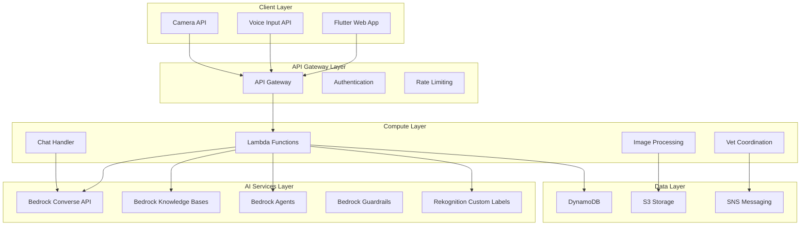

# Design Document: AI-Powered Livestock Health Assistant (ALHA)

## Overview

The AI-Powered Livestock Health Assistant (ALHA) is a comprehensive mobile-first web application that leverages AWS AI services to provide rural farmers in India with intelligent livestock health monitoring, disease detection, and veterinary coordination. The system addresses critical challenges including veterinary shortages, delayed diagnosis, knowledge gaps, and preventable economic losses through an integrated platform combining computer vision, natural language processing, and autonomous agent capabilities.

The architecture follows a serverless, cloud-native approach using AWS services to ensure scalability, reliability, and cost-effectiveness while maintaining high availability even in areas with limited connectivity. The system prioritizes accessibility through multi-language support (8+ Indian regional languages), voice-enabled interfaces, and offline-capable functionality designed for resource-constrained rural environments.

## Architecture

### High-Level Architecture



### Component Architecture

The system is organized into five primary architectural layers:

1. **Client Layer**: Flutter Progressive Web App with offline capabilities, voice input, and multi-language support
2. **API Gateway Layer**: Request routing, authentication, rate limiting, and CORS management
3. **Compute Layer**: Serverless Lambda functions for business logic orchestration
4. **AI Services Layer**: AWS Bedrock (Converse API, Knowledge Bases, Agents, Guardrails) and Rekognition Custom Labels
5. **Data Layer**: DynamoDB for structured data, S3 for images, SNS for notifications

### Key Design Principles

- **Mobile-First**: Optimized for basic smartphones with limited connectivity
- **Accessibility**: Multi-language support with voice interfaces for low-literacy users
- **Safety**: Comprehensive guardrails and medical disclaimers to ensure appropriate guidance
- **Privacy**: PII detection and encryption for farmer data protection
- **Scalability**: Serverless architecture to handle variable load patterns
- **Offline-Capable**: Critical features cached locally for intermittent connectivity scenarios

## Components and Interfaces

### Frontend Components

#### Flutter Web Application
- **Progressive Web App (PWA)** with service worker for offline functionality and caching
- **Responsive Design** optimized for mobile devices with touch-friendly interfaces and large buttons
- **Voice Input Integration** using browser Web Speech API for hands-free operation
- **Camera Integration** using MediaDevices API for image capture with quality guidance
- **Offline Storage** using IndexedDB for caching critical functionality and consultation history
- **Multi-language UI** supporting 8+ Indian languages (Hindi, English, Tamil, Telugu, Kannada, Marathi, Bengali, Gujarati) with automatic detection
- **Progress Indicators** for loading states with estimated completion times
- **Notification Management** for alerts, reminders, and appointment confirmations

#### Key Frontend Modules:
- `CameraModule`: Handles image capture, preprocessing, quality validation, and guidance for better photos
- `VoiceModule`: Manages speech-to-text and text-to-speech with multi-language support
- `ChatInterface`: Conversational UI with context management, message history, and follow-up suggestions
- `OfflineManager`: Handles offline functionality, data synchronization, and conflict resolution
- `LanguageManager`: Manages multi-language support, translation, and locally appropriate terminology
- `NotificationManager`: Handles SMS alerts, vaccination reminders, and appointment notifications
- `ProfileManager`: Manages farmer profiles, livestock records, and consultation history

### Backend Components

#### API Gateway Layer
- **AWS API Gateway** for RESTful API endpoints
- **Cognito Authentication** for user management with minimal registration
- **Rate Limiting** to prevent abuse and manage costs
- **CORS Configuration** for cross-origin requests from web app

#### Lambda Functions

##### Image Analysis Function
Processes livestock images using Rekognition Custom Labels and Bedrock for disease detection.

```typescript
interface ImageAnalysisRequest {
  imageBase64: string;
  farmerId: string;
  animalId?: string;
  animalType: string;
  symptoms?: string[];
  language: string;
}

interface ImageAnalysisResponse {
  diseaseDetected: boolean;
  conditions: DetectedCondition[];
  overallConfidence: number;
  recommendations: string[];
  requiresVet: boolean;
  criticalCase: boolean;
  explanationLanguage: string;
  imageQualityAcceptable: boolean;
  qualityGuidance?: string[];
  processingTimeMs: number;
}

interface DetectedCondition {
  conditionName: string;
  confidence: number;
  severity: SeverityLevel;
  affectedRegions: BodyRegion[];
  explanation: string;
  recommendedActions: string[];
}
```

##### Chat Handler Function
Manages conversational interactions using Bedrock Converse API with Knowledge Base integration.

```typescript
interface ChatRequest {
  message: string;
  language: string;
  sessionId: string;
  farmerId: string;
  context: ConversationContext;
  animalType?: string;
}

interface ChatResponse {
  response: string;
  language: string;
  followUpQuestions?: string[];
  actionRequired?: ActionType;
  citations?: Citation[];
  confidence: number;
  requiresVetConsultation: boolean;
  disclaimer?: string;
  responseTimeMs: number;
}

interface ConversationContext {
  previousMessages: ChatMessage[];
  currentAnimal?: LivestockRecord;
  recentDiagnoses?: DiagnosisResult[];
  farmerPreferences: FarmerPreferences;
}
```

##### Vet Coordination Function
Autonomous agent for finding and connecting farmers with veterinarians.

```typescript
interface VetCoordinationRequest {
  farmerId: string;
  location: GeoLocation;
  urgency: UrgencyLevel;
  animalType: string;
  condition: string;
  detectedConditions: DetectedCondition[];
}

interface VetCoordinationResponse {
  veterinarians: VeterinarianMatch[];
  estimatedArrival?: number;
  emergencyInstructions?: string[];
  smsNotificationsSent: boolean;
  escalatedToRegional: boolean;
  specialistType: VeterinarySpecialty;
}

interface VeterinarianMatch {
  vetId: string;
  name: string;
  specialty: VeterinarySpecialty;
  distanceKm: number;
  available: boolean;
  phoneNumber: string;
  estimatedArrivalMinutes?: number;
}
```

##### Notification Handler Function
Manages SMS notifications, vaccination reminders, and alerts.

```typescript
interface NotificationRequest {
  type: NotificationType;
  recipients: Recipient[];
  priority: PriorityLevel;
  message: string;
  language: string;
  scheduledTime?: Date;
}

interface NotificationResponse {
  notificationId: string;
  deliveryStatus: DeliveryStatus[];
  failedRecipients: string[];
  retryScheduled: boolean;
}
```

### AI Services Integration

#### Amazon Bedrock Services

##### Converse API Integration
- **Claude 4 Sonnet** for multimodal analysis (text + images) with vision capabilities
- **Multi-language Support** for 8+ Indian languages with context-aware translation
- **Context Management** for multi-turn conversations with session state preservation
- **Streaming Responses** for real-time interaction and improved user experience
- **System Prompts** configured for veterinary domain expertise and farmer-friendly language
- **Temperature Control** for consistent medical advice (low temperature) vs. conversational responses (moderate temperature)

##### Knowledge Bases (RAG)
- **ICAR Literature Integration** with automated ingestion pipeline for veterinary research papers
- **NDDB Guidelines** for standardized veterinary practices and protocols
- **Citation Management** for source attribution and credibility
- **Semantic Search** using Cohere Embed Multilingual v3 for cross-language retrieval
- **Monthly Updates** to maintain accuracy with latest veterinary information
- **Conflict Resolution** logic to prioritize most recent and authoritative sources
- **Chunking Strategy** optimized for medical document structure (sections, subsections, tables)

##### Bedrock Agents
- **Autonomous Planning** for veterinary coordination with multi-step reasoning
- **Tool Integration** for external API calls (SMS, geolocation, database queries)
- **Decision Trees** for escalation logic based on urgency and availability
- **Action Execution** with human oversight for critical cases
- **Specialist Determination** logic based on detected conditions and animal types
- **Availability Checking** with real-time veterinarian status queries

##### Guardrails Configuration
- **Content Filtering** for inappropriate medical advice and harmful recommendations
- **PII Detection** and redaction for privacy protection (names, phone numbers, addresses)
- **Medical Disclaimers** automatically appended to all medical advice
- **Toxicity Prevention** for safe interactions and professional tone
- **Denied Topics** configuration to prevent discussion of euthanasia, unverified treatments
- **Confidence Thresholds** to trigger veterinary consultation recommendations

#### Amazon Rekognition Custom Labels
- **Disease Pattern Recognition** trained on livestock health datasets with veterinary validation
- **Multi-region Analysis** focusing on diagnostic areas:
  - **Eyes**: Discharge, cloudiness, inflammation, conjunctivitis
  - **Skin**: Lesions, discoloration, parasites, wounds
  - **Posture**: Lameness, abnormal stance, weakness indicators
  - **Udder**: Swelling, discoloration, mastitis indicators
- **Confidence Scoring** for reliability assessment with minimum thresholds
- **Custom Model Training** with veterinary-validated datasets from ICAR and field data
- **Image Enhancement** preprocessing for better analysis quality
- **Quality Validation** to reject poor-quality images with specific guidance

## Data Models

### Core Data Entities

#### Farmer Profile
```typescript
interface FarmerProfile {
  farmerId: string;
  phoneNumber: string;
  preferredLanguage: string;
  location: GeoLocation;
  livestockCount: number;
  registrationDate: Date;
  subscriptionTier: string;
  notificationPreferences: NotificationPreferences;
  dataRetentionConsent: boolean;
}

interface NotificationPreferences {
  enableSMS: boolean;
  enableVaccinationReminders: boolean;
  reminderAdvanceDays: number;
  emergencyAlertsOnly: boolean;
  preferredContactTime?: TimeRange;
}
```

#### Livestock Record
```typescript
interface LivestockRecord {
  animalId: string;
  farmerId: string;
  species: AnimalSpecies;
  breed?: string;
  age: number;
  healthHistory: HealthEvent[];
  vaccinationSchedule: VaccinationRecord[];
  currentStatus: HealthStatus;
  lastCheckupDate?: Date;
  feedingSchedule?: FeedingSchedule;
}

interface VaccinationRecord {
  vaccineName: string;
  scheduledDate: Date;
  administeredDate?: Date;
  nextDueDate: Date;
  reminderSent: boolean;
  veterinarianId?: string;
}

interface FeedingSchedule {
  species: AnimalSpecies;
  feedType: string[];
  frequency: number;
  specialInstructions?: string;
}
```

#### Consultation Session
```typescript
interface ConsultationSession {
  sessionId: string;
  farmerId: string;
  animalId?: string;
  startTime: Date;
  endTime?: Date;
  language: string;
  messages: ChatMessage[];
  images: ImageAnalysis[];
  diagnosis?: DiagnosisResult;
  veterinarianReferral?: VetReferral;
  followUpRequired: boolean;
  criticalCase: boolean;
  auditLog: AuditEntry[];
}

interface ChatMessage {
  messageId: string;
  timestamp: Date;
  sender: 'farmer' | 'system';
  content: string;
  language: string;
  citations?: Citation[];
  confidence?: number;
}

interface AuditEntry {
  timestamp: Date;
  action: string;
  details: Record<string, any>;
  systemComponent: string;
}
```

#### Disease Detection Result
```typescript
interface DiseaseDetectionResult {
  detectionId: string;
  imageUrl: string;
  imageQuality: QualityMetrics;
  detectedConditions: DetectedCondition[];
  overallConfidence: number;
  analysisTimestamp: Date;
  processingTimeMs: number;
  veterinaryReview?: VeterinaryReview;
  requiresEscalation: boolean;
}

interface DetectedCondition {
  conditionName: string;
  confidence: number;
  severity: SeverityLevel;
  affectedRegions: BodyRegion[];
  explanation: string;
  explanationLanguage: string;
  recommendedActions: string[];
  citations?: Citation[];
}

interface QualityMetrics {
  resolution: number;
  brightness: number;
  focus: number;
  acceptable: boolean;
  improvementSuggestions?: string[];
}

interface Citation {
  source: string;
  title: string;
  url?: string;
  publicationDate?: Date;
  authority: 'ICAR' | 'NDDB' | 'Other';
}
```

#### Veterinarian Coordination
```typescript
interface VetReferral {
  referralId: string;
  farmerId: string;
  animalId: string;
  urgency: UrgencyLevel;
  condition: string;
  assignedVet?: VeterinarianMatch;
  status: ReferralStatus;
  createdAt: Date;
  resolvedAt?: Date;
  smsNotifications: NotificationRecord[];
  emergencyInstructions?: string[];
  escalatedToRegional: boolean;
}

interface NotificationRecord {
  notificationId: string;
  recipient: string;
  message: string;
  sentAt: Date;
  deliveryStatus: 'sent' | 'delivered' | 'failed';
  retryCount: number;
}
```

### Database Schema Design

#### DynamoDB Tables

##### Users Table
- **Partition Key**: farmerId
- **Attributes**: profile data, preferences, subscription info, notification settings
- **GSI-1**: phoneNumber (for lookup during registration and SMS delivery)
- **GSI-2**: location (for geographic queries and vet coordination)
- **TTL**: Not applicable (permanent records with explicit deletion support)
- **Encryption**: At-rest encryption enabled for PII protection

##### Consultations Table
- **Partition Key**: farmerId
- **Sort Key**: sessionId (timestamp-based for chronological ordering)
- **Attributes**: consultation data, messages, results, audit logs
- **GSI-1**: sessionId (for direct session lookup)
- **GSI-2**: animalId (for animal-specific health history)
- **TTL**: 2 years (63,072,000 seconds) for data retention compliance
- **Encryption**: At-rest encryption enabled for medical data protection

##### Livestock Table
- **Partition Key**: farmerId
- **Sort Key**: animalId
- **Attributes**: animal profile, health history, vaccination schedule, feeding schedule
- **GSI-1**: animalId (for cross-farmer queries in research scenarios)
- **GSI-2**: species (for species-specific analytics)
- **TTL**: Not applicable (permanent records with explicit deletion support)
- **Encryption**: At-rest encryption enabled

##### Disease_Detections Table
- **Partition Key**: farmerId
- **Sort Key**: detectionId (timestamp-based)
- **Attributes**: analysis results, images, recommendations, quality metrics, citations
- **GSI-1**: timestamp (for chronological queries and trend analysis)
- **GSI-2**: animalId (for animal-specific disease tracking)
- **TTL**: 5 years (157,680,000 seconds) for research and model improvement
- **Encryption**: At-rest encryption enabled

##### Veterinarians Table
- **Partition Key**: vetId
- **Attributes**: name, specialty, location, availability status, contact info
- **GSI-1**: location (for geographic search within 50km radius)
- **GSI-2**: specialty (for specialist matching)
- **TTL**: Not applicable (permanent records)
- **Encryption**: At-rest encryption enabled

##### Notifications Table
- **Partition Key**: farmerId
- **Sort Key**: notificationId (timestamp-based)
- **Attributes**: notification type, message, delivery status, retry count
- **GSI-1**: scheduledTime (for vaccination reminders and scheduled alerts)
- **GSI-2**: deliveryStatus (for monitoring failed deliveries)
- **TTL**: 90 days (7,776,000 seconds) for notification history
- **Encryption**: At-rest encryption enabled

#### S3 Buckets

##### Livestock Images Bucket
- **Purpose**: Store uploaded livestock photos for analysis
- **Lifecycle Policy**: Move to Glacier after 1 year, delete after 5 years
- **Encryption**: Server-side encryption with AWS KMS
- **Access Control**: Private with signed URLs for time-limited access
- **Versioning**: Disabled (images are immutable)

##### Knowledge Base Documents Bucket
- **Purpose**: Store ICAR and NDDB veterinary literature for RAG
- **Lifecycle Policy**: Retain indefinitely with monthly updates
- **Encryption**: Server-side encryption with AWS KMS
- **Access Control**: Private with Bedrock service access only
- **Versioning**: Enabled for document update tracking

## Correctness Properties

*A property is a characteristic or behavior that should hold true across all valid executions of a system—essentially, a formal statement about what the system should do. Properties serve as the bridge between human-readable specifications and machine-verifiable correctness guarantees.*

Based on the prework analysis and property reflection, the following correctness properties validate the system's core functionality:

### Property 1: Image Analysis Performance
*For any* valid livestock image upload, the Disease_Detection_Engine should complete analysis and return results within 30 seconds
**Validates: Requirements 1.1, 9.4**

### Property 2: Comprehensive Region Analysis
*For any* livestock image analysis, the Disease_Detection_Engine should examine and report findings for all four diagnostic regions (eyes, skin, posture, udder)
**Validates: Requirements 1.2, 9.3**

### Property 3: Disease Explanation Language
*For any* detected disease condition, the explanation should be provided in either simple Hindi or simple English
**Validates: Requirements 1.3**

### Property 4: Image Quality Validation and Guidance
*For any* uploaded image with insufficient quality (low resolution, poor focus, inadequate brightness), the system should reject the image and provide specific guidance for capturing a better photo
**Validates: Requirements 1.4**

### Property 5: Condition Severity Prioritization
*For any* analysis result containing multiple detected conditions, the conditions should be ordered by severity level with the most critical conditions appearing first
**Validates: Requirements 1.5**

### Property 6: Multi-Language Input Support
*For any* input (text or voice) in the 8+ supported Indian languages (Hindi, English, Tamil, Telugu, Kannada, Marathi, Bengali, Gujarati), the system should successfully process and respond in the same language
**Validates: Requirements 2.1, 7.1**

### Property 7: Species-Specific Feeding Recommendations
*For any* feeding schedule query that mentions an animal species, the response should include recommendations specific to that species
**Validates: Requirements 2.2**

### Property 8: Vaccination Schedule Guidance
*For any* vaccination inquiry, the system should provide schedule information including timing and reminders
**Validates: Requirements 2.3**

### Property 9: Conversation Context Preservation
*For any* multi-turn conversation, information mentioned in previous messages (symptoms, animal details, diagnoses) should be retained and referenced in subsequent responses
**Validates: Requirements 2.4**

### Property 10: Chat Response Performance
*For any* chat message, the Conversational_Assistant should respond within 5 seconds
**Validates: Requirements 2.5**

### Property 11: Medical Information Citation
*For any* medical information or advice provided by the Knowledge_Base, the response should include source citations from ICAR or NDDB literature
**Validates: Requirements 3.2**

### Property 12: Low Confidence Veterinary Recommendation
*For any* medical advice response where system confidence is below the defined threshold, the response should explicitly state limitations and recommend veterinary consultation
**Validates: Requirements 3.3**

### Property 13: Authoritative Source Prioritization
*For any* medical query with conflicting information in the knowledge base, the system should present guidance from the most recent and authoritative source
**Validates: Requirements 3.5**

### Property 14: Specialist Type Determination
*For any* critical health case with detected conditions, the Vet_Coordination_Agent should correctly identify the required veterinary specialist type (e.g., large animal specialist, reproduction specialist, surgery specialist)
**Validates: Requirements 4.1**

### Property 15: Geographic Veterinarian Search
*For any* farmer location, the Vet_Coordination_Agent should find all veterinarians within a 50km radius
**Validates: Requirements 4.2**

### Property 16: Veterinarian Availability Verification
*For any* veterinarian found in the search, the system should check and report their current availability status
**Validates: Requirements 4.3**

### Property 17: Dual SMS Notification Delivery
*For any* successful veterinarian match, SMS alerts should be sent to both the farmer and the assigned veterinarian
**Validates: Requirements 4.4**

### Property 18: Emergency Fallback Procedures
*For any* critical case where no veterinarians are available within the search radius, the system should provide emergency care instructions and escalate to regional veterinary services
**Validates: Requirements 4.5**

### Property 19: Content Safety Filtering
*For any* system-generated output (medical advice, recommendations, explanations), the content should pass safety guardrails and be free of inappropriate or harmful medical advice
**Validates: Requirements 5.1**

### Property 20: PII Detection and Redaction
*For any* farmer data processed by the system, personally identifiable information (names, phone numbers, addresses) should be detected and properly redacted or encrypted before storage
**Validates: Requirements 5.2**

### Property 21: Medical Disclaimer Inclusion
*For any* medical advice or health recommendation, the response should include an appropriate disclaimer about the importance of veterinary consultation
**Validates: Requirements 5.3**

### Property 22: Critical Case Escalation
*For any* identified critical health case (high severity conditions, life-threatening symptoms), the system should automatically escalate to human veterinary professionals
**Validates: Requirements 5.4**

### Property 23: Medical Recommendation Audit Logging
*For any* medical recommendation or diagnosis provided by the system, a complete audit log entry should be created with timestamp, inputs, outputs, and system decisions
**Validates: Requirements 5.5**

### Property 24: Offline Feature Accessibility
*For any* essential feature (consultation history, basic care guidance, emergency instructions), when network connectivity is poor or unavailable, the feature should remain accessible through local caching
**Validates: Requirements 6.2**

### Property 25: Loading Progress Indicators
*For any* loading operation (image upload, analysis processing, vet search), the system should display progress indicators with estimated completion times
**Validates: Requirements 6.5**

### Property 26: Language Switch Context Preservation
*For any* conversation where the farmer switches languages mid-session, the system should maintain all previous conversation context and history
**Validates: Requirements 7.2**

### Property 27: Locally Appropriate Medical Terminology
*For any* medical term translation, the system should use locally appropriate and culturally relevant terminology rather than direct literal translations
**Validates: Requirements 7.3**

### Property 28: Automatic Language Detection
*For any* initial user input, the system should correctly detect the farmer's preferred language from the text or voice input
**Validates: Requirements 7.4**

### Property 29: Language Detection Uncertainty Handling
*For any* initial input where language detection confidence is below threshold, the system should prompt the farmer to manually select their preferred language
**Validates: Requirements 7.5**

### Property 30: Livestock Data Organization
*For any* stored livestock information, the data should be properly organized and retrievable by animal identifier and health condition
**Validates: Requirements 8.3**

### Property 31: Data Deletion Compliance
*For any* farmer data deletion request, the system should complete deletion within 30 days while preserving anonymized research data (with all PII removed)
**Validates: Requirements 8.5**

### Property 32: Image Format Support
*For any* common mobile image format (JPEG, PNG, HEIC), the system should successfully accept and process the uploaded image
**Validates: Requirements 9.1**

### Property 33: Automatic Image Enhancement
*For any* uploaded livestock image, the system should apply automatic enhancement (brightness adjustment, contrast optimization, noise reduction) before analysis
**Validates: Requirements 9.2**

### Property 34: Confidence Score Provision
*For any* completed image analysis with detected conditions, the system should provide confidence scores (0-100%) for each detected condition
**Validates: Requirements 9.5**

### Property 35: Critical Health Alert SMS Delivery
*For any* critical health alert identified by the system, an SMS notification should be sent to the farmer
**Validates: Requirements 10.1**

### Property 36: Vaccination Reminder Timing
*For any* vaccination due date in the livestock schedule, the system should send a reminder SMS exactly 7 days in advance
**Validates: Requirements 10.2**

### Property 37: Appointment Confirmation Delivery
*For any* scheduled veterinary appointment, confirmation messages should be sent to both the farmer and the veterinarian
**Validates: Requirements 10.3**

### Property 38: Notification Preference Customization
*For any* farmer's notification preferences (SMS enabled/disabled, reminder advance days, emergency only mode), the system should respect and apply these settings across all notification types
**Validates: Requirements 10.4**

### Property 39: Emergency Alert Priority Routing
*For any* emergency health situation, the system should send immediate alerts with priority routing (bypassing normal notification queues)
**Validates: Requirements 10.5**

## Error Handling

### Error Classification and Response Strategy

The system implements a comprehensive error handling strategy that categorizes errors by severity and provides appropriate responses:

#### Critical Errors (System Unavailable)
- **AI Service Failures**: When Bedrock or Rekognition services are unavailable:
  - Implement circuit breaker pattern with 3 consecutive failure threshold
  - Provide cached responses for common queries
  - Display clear error message: "AI services temporarily unavailable. Emergency instructions available offline."
  - Escalate to human support for critical cases
  - Log incidents for post-mortem analysis

- **Database Outages**: When DynamoDB is unavailable:
  - Implement circuit breaker with graceful degradation to read-only mode
  - Serve cached consultation history from local storage
  - Queue write operations for retry when service recovers
  - Display status message: "Some features temporarily limited. Your data is safe."

- **Authentication Failures**: When Cognito is unavailable:
  - Provide guest mode with limited functionality (read-only access to general care guides)
  - Cache authentication tokens with extended TTL for offline scenarios
  - Allow emergency access to critical features without authentication

#### Recoverable Errors (Retry Logic)
- **Network Timeouts**: 
  - Implement exponential backoff: 1s, 2s, 4s delays
  - Maximum 3 retry attempts before failing
  - Display retry progress to user: "Retrying... (attempt 2 of 3)"
  - Offer manual retry option after automatic attempts exhausted

- **Rate Limiting**: 
  - Queue requests with priority (critical cases first)
  - Display wait time estimate: "High demand. Estimated wait: 30 seconds"
  - Implement token bucket algorithm for fair request distribution
  - Provide offline alternatives while waiting

- **Image Processing Failures**: 
  - Detect specific failure reasons (format unsupported, file corrupted, size exceeded)
  - Request image resubmission with specific guidance:
    - "Image too large. Please compress to under 10MB"
    - "Image format not supported. Please use JPEG or PNG"
    - "Image appears corrupted. Please retake the photo"
  - Offer camera tips for better image capture

#### User Input Errors (Validation and Guidance)
- **Invalid Image Formats**: 
  - Validate file extension and MIME type before upload
  - Provide clear error: "Unsupported format. Please use JPEG, PNG, or HEIC"
  - Show supported format list with examples

- **Poor Image Quality**: 
  - Analyze quality metrics (resolution, brightness, focus)
  - Provide specific guidance:
    - "Image too dark. Please take photo in better lighting"
    - "Image blurry. Please hold camera steady"
    - "Image too far. Please move closer to the animal"
  - Show example of good quality image

- **Unsupported Languages**: 
  - Detect language from input
  - If unsupported, gracefully fallback to English
  - Offer translation: "Your language is not yet supported. Showing results in English. Translation coming soon."
  - Log unsupported language requests for future prioritization

- **Incomplete Input**: 
  - Validate required fields before processing
  - Highlight missing information with clear prompts
  - Provide examples of complete input

#### Data Consistency Errors
- **Conflicting Medical Information**: 
  - Present multiple viewpoints with source attribution
  - Highlight most recent and authoritative source
  - Include publication dates for context
  - Recommend veterinary consultation for final decision

- **Incomplete Veterinarian Data**: 
  - Provide partial results with data quality indicators
  - Mark fields as "Information not available"
  - Offer alternative veterinarians with complete profiles
  - Allow farmers to proceed with available information

- **Session State Corruption**: 
  - Detect inconsistent session state through checksums
  - Attempt context recovery from audit logs
  - If recovery fails, restart conversation with apology
  - Preserve critical information (animal ID, detected conditions)

#### External Service Errors
- **SMS Delivery Failures**: 
  - Retry with exponential backoff (3 attempts)
  - Log failed deliveries for manual follow-up
  - Provide alternative notification methods (in-app alerts)
  - Display delivery status to farmers

- **Geolocation Service Failures**: 
  - Fallback to manual location entry
  - Use last known location if available
  - Expand search radius if precise location unavailable
  - Inform user of reduced accuracy

### Error Monitoring and Alerting

- **CloudWatch Integration**: 
  - Real-time monitoring of error rates by type and severity
  - Custom metrics for AI service latency and accuracy
  - Dashboard for system health visualization
  - Automated anomaly detection

- **Automated Alerting**: 
  - Immediate PagerDuty alerts for critical system failures
  - Slack notifications for elevated error rates
  - Email summaries for daily error trends
  - Escalation policies for unresolved incidents

- **Error Analytics**: 
  - Trend analysis for proactive system improvements
  - Root cause analysis for recurring errors
  - User impact assessment (affected farmers, lost consultations)
  - Performance degradation detection

- **User Feedback Loop**: 
  - In-app mechanism for farmers to report issues
  - Automatic error report generation with context
  - Status updates on reported issues
  - Feedback on implemented fixes

### Error Recovery Procedures

- **Automatic Recovery**: 
  - Self-healing for transient failures
  - Automatic service restart for crashed components
  - Data reconciliation after outages
  - Cache invalidation and refresh

- **Manual Intervention**: 
  - Runbooks for common failure scenarios
  - On-call engineer escalation procedures
  - Database rollback procedures
  - Emergency maintenance mode activation

- **User Communication**: 
  - Status page for system-wide issues
  - In-app banners for known problems
  - SMS alerts for critical service disruptions
  - Estimated resolution times

## Testing Strategy

### Dual Testing Approach

The ALHA system requires both unit testing and property-based testing to ensure comprehensive coverage and reliability. These approaches are complementary and both are necessary:

#### Unit Testing Focus
Unit tests validate specific examples, edge cases, and integration points:

- **Specific Examples**: Test concrete scenarios with known inputs and expected outputs
  - Example: "Farmer uploads cow eye infection photo → System detects conjunctivitis with 85% confidence"
  - Example: "Farmer asks 'What should I feed my buffalo?' → System provides buffalo-specific feeding schedule"
  - Example: "Critical case detected → SMS sent to farmer and nearest available vet"

- **Edge Cases**: Test boundary conditions and unusual scenarios
  - Maximum image size limits (10MB boundary)
  - Empty or whitespace-only chat messages
  - Farmer location at exactly 50km from veterinarian
  - Vaccination due date exactly 7 days from today
  - Zero available veterinarians in search radius

- **Integration Points**: Test API endpoints, database connections, and external service integrations
  - API Gateway authentication and authorization
  - DynamoDB read/write operations with proper error handling
  - S3 image upload and retrieval with signed URLs
  - SNS SMS delivery with delivery status tracking
  - Bedrock API calls with proper timeout handling

- **Error Conditions**: Test specific failure scenarios and recovery mechanisms
  - Bedrock service unavailable → Fallback to cached responses
  - DynamoDB throttling → Exponential backoff retry
  - Invalid image format upload → Clear error message with guidance
  - SMS delivery failure → Retry logic and alternative notification

#### Property-Based Testing Focus
Property tests validate universal properties that must hold across all valid inputs:

- **Universal Properties**: Test properties that must hold for all inputs
  - All image analyses complete within 30 seconds (regardless of image content)
  - All chat responses include medical disclaimers (regardless of query)
  - All detected conditions include confidence scores between 0-100%
  - All critical cases trigger escalation (regardless of condition type)

- **Comprehensive Input Coverage**: Generate thousands of test cases automatically
  - Random livestock images with varying quality, lighting, angles
  - Random chat messages in all 8+ supported languages
  - Random farmer locations across India
  - Random veterinarian availability patterns
  - Random notification preference combinations

- **Invariant Validation**: Ensure system invariants are maintained under all conditions
  - Context preservation: Previous messages always accessible in conversation history
  - Data organization: Livestock data always retrievable by animal ID
  - Severity ordering: Multiple conditions always sorted by severity
  - Citation inclusion: Medical advice always includes source citations

- **Regression Prevention**: Catch edge cases that manual testing might miss
  - Unusual language combinations (code-switching between Hindi and English)
  - Extreme geographic coordinates (border regions, remote areas)
  - Unusual timing scenarios (midnight vaccinations, timezone boundaries)
  - Rare condition combinations (multiple simultaneous diseases)

### Property-Based Testing Configuration

The system will use **Hypothesis** (Python) for Lambda functions and **fast-check** (TypeScript) for frontend components:

#### Hypothesis Configuration (Python/Lambda)
```python
from hypothesis import given, settings, strategies as st

# Custom strategies for domain-specific data
livestock_image = st.binary(min_size=1024, max_size=10*1024*1024)  # 1KB to 10MB
indian_language = st.sampled_from(['hi', 'en', 'ta', 'te', 'kn', 'mr', 'bn', 'gu'])
geo_location = st.builds(
    lambda lat, lon: {'latitude': lat, 'longitude': lon},
    lat=st.floats(min_value=8.0, max_value=37.0),  # India bounds
    lon=st.floats(min_value=68.0, max_value=97.0)
)

@settings(max_examples=100, deadline=None)
@given(image=livestock_image, language=indian_language)
def test_property_1_image_analysis_performance(image, language):
    """Feature: ai-livestock-health-assistant, Property 1: Image Analysis Performance"""
    # Test implementation
```

#### fast-check Configuration (TypeScript/Frontend)
```typescript
import fc from 'fast-check';

// Custom arbitraries for domain-specific data
const livestockImageArb = fc.uint8Array({ minLength: 1024, maxLength: 10*1024*1024 });
const indianLanguageArb = fc.constantFrom('hi', 'en', 'ta', 'te', 'kn', 'mr', 'bn', 'gu');
const geoLocationArb = fc.record({
  latitude: fc.float({ min: 8.0, max: 37.0 }),
  longitude: fc.float({ min: 68.0, max: 97.0 })
});

fc.assert(
  fc.property(livestockImageArb, indianLanguageArb, async (image, language) => {
    // Feature: ai-livestock-health-assistant, Property 1: Image Analysis Performance
    // Test implementation
  }),
  { numRuns: 100 }
);
```

#### Configuration Requirements
- **Minimum 100 iterations** per property test to ensure statistical confidence
- **Custom Generators** for domain-specific data:
  - Livestock images with realistic characteristics
  - Medical terminology in multiple languages
  - Farmer profiles with Indian geographic distribution
  - Veterinarian availability patterns
  - Disease condition combinations
  
- **Shrinking Strategies** to find minimal failing examples:
  - Hypothesis automatically shrinks failing inputs to simplest case
  - fast-check provides integrated shrinking for TypeScript
  - Custom shrinking for complex domain objects
  
- **Seed Management** for reproducible test runs:
  - Fixed seeds for CI/CD pipeline consistency
  - Random seeds for local development exploration
  - Seed logging for debugging failed test cases

### Test Implementation Requirements

Each correctness property must be implemented as a single property-based test with the following tag format:

**Tag Format**: `Feature: ai-livestock-health-assistant, Property {number}: {property_text}`

**Example Implementation**:
```python
from hypothesis import given, settings
import time

@settings(max_examples=100, deadline=None)
@given(
    livestock_image=livestock_image_generator(),
    farmer_location=geo_location_generator()
)
def test_property_1_image_analysis_performance(livestock_image, farmer_location):
    """
    Feature: ai-livestock-health-assistant, Property 1: Image Analysis Performance
    
    For any valid livestock image upload, the Disease_Detection_Engine should 
    complete analysis and return results within 30 seconds.
    
    Validates: Requirements 1.1, 9.4
    """
    start_time = time.time()
    
    result = disease_detection_engine.analyze_image(
        image=livestock_image,
        location=farmer_location
    )
    
    end_time = time.time()
    elapsed_time = end_time - start_time
    
    # Assert performance requirement
    assert elapsed_time < 30.0, f"Analysis took {elapsed_time}s, expected < 30s"
    
    # Assert result validity
    assert result is not None
    assert result.confidence >= 0.0 and result.confidence <= 100.0
    assert len(result.conditions) >= 0
```

### Testing Infrastructure

#### Automated Test Execution
- **CI/CD Pipeline Integration**: 
  - All tests run on every pull request
  - Property tests run with fixed seeds for consistency
  - Parallel test execution for faster feedback
  - Test results published to dashboard

- **Test Environments**: 
  - Unit tests: Local development environment
  - Integration tests: Staging environment with mock AWS services
  - Property tests: Dedicated test environment with production-like data
  - End-to-end tests: Pre-production environment

#### Test Data Management
- **Synthetic Data Generation**: 
  - Livestock image generation using GANs or diffusion models
  - Medical scenario creation based on ICAR case studies
  - Farmer profile generation with realistic Indian demographics
  - Veterinarian network simulation with geographic distribution

- **Test Data Privacy**: 
  - No real farmer data in test environments
  - Synthetic PII for privacy testing
  - Anonymized historical data for model validation
  - Secure test data storage and access controls

#### Performance Benchmarking
- **Continuous Monitoring**: 
  - Response time tracking for all properties
  - Performance regression detection
  - Latency percentiles (p50, p95, p99)
  - Throughput measurement under load

- **Performance Baselines**: 
  - Image analysis: < 30 seconds (p99)
  - Chat response: < 5 seconds (p99)
  - Vet search: < 10 seconds (p95)
  - SMS delivery: < 30 seconds (p95)

#### Quality Gates
- **Deployment Criteria**: 
  - All unit tests must pass (100% pass rate)
  - All property tests must pass (100% pass rate)
  - Code coverage > 80% for critical paths
  - No critical or high severity security vulnerabilities
  - Performance benchmarks within acceptable ranges

- **Test Failure Handling**: 
  - Automatic rollback on test failures
  - Incident creation for property test failures
  - Root cause analysis for flaky tests
  - Test quarantine for consistently failing tests

### Test Coverage Goals

- **Unit Test Coverage**: 80%+ for all Lambda functions and frontend components
- **Property Test Coverage**: 100% of correctness properties implemented
- **Integration Test Coverage**: All API endpoints and external service integrations
- **End-to-End Test Coverage**: Critical user journeys (image upload → diagnosis → vet coordination)
