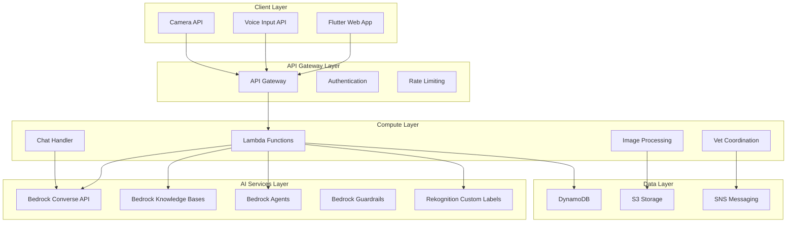

# Design Document: AI-Powered Livestock Health Assistant (ALHA)

## Overview

The AI-Powered Livestock Health Assistant (ALHA) is a comprehensive mobile-first web application that leverages AWS AI services to provide rural farmers with intelligent livestock health monitoring, disease detection, and veterinary coordination. The system combines computer vision, natural language processing, and autonomous agent capabilities to bridge the gap between farmers and veterinary care in resource-constrained rural environments.

The architecture follows a serverless, cloud-native approach using AWS services to ensure scalability, reliability, and cost-effectiveness while maintaining high availability even in areas with limited connectivity.

## Architecture

### High-Level Architecture



### Component Architecture

The system is organized into five primary architectural layers:

1. **Client Layer**: Flutter Progressive Web App with offline capabilities
2. **API Gateway Layer**: Request routing, authentication, and rate limiting
3. **Compute Layer**: Serverless Lambda functions for business logic
4. **AI Services Layer**: AWS Bedrock and Rekognition for AI capabilities
5. **Data Layer**: Storage and messaging services

## Components and Interfaces

### Frontend Components

#### Flutter Web Application
- **Progressive Web App (PWA)** with service worker for offline functionality
- **Responsive Design** optimized for mobile devices with touch-friendly interfaces
- **Voice Input Integration** using browser Web Speech API
- **Camera Integration** using MediaDevices API for image capture
- **Offline Storage** using IndexedDB for caching critical functionality
- **Multi-language UI** supporting 8+ Indian languages with automatic detection

#### Key Frontend Modules:
- `CameraModule`: Handles image capture and preprocessing
- `VoiceModule`: Manages speech-to-text and text-to-speech
- `ChatInterface`: Conversational UI with context management
- `OfflineManager`: Handles offline functionality and data synchronization
- `LanguageManager`: Manages multi-language support and translation

### Backend Components

#### API Gateway Layer
- **AWS API Gateway** for RESTful API endpoints
- **Cognito Authentication** for user management with minimal registration
- **Rate Limiting** to prevent abuse and manage costs
- **CORS Configuration** for cross-origin requests from web app

#### Lambda Functions

##### Image Analysis Function
```typescript
interface ImageAnalysisRequest {
  imageBase64: string;
  farmerId: string;
  animalId?: string;
  symptoms?: string[];
}

interface ImageAnalysisResponse {
  diseaseDetected: boolean;
  conditions: DetectedCondition[];
  confidence: number;
  recommendations: string[];
  requiresVet: boolean;
}
```

##### Chat Handler Function
```typescript
interface ChatRequest {
  message: string;
  language: string;
  sessionId: string;
  context: ConversationContext;
}

interface ChatResponse {
  response: string;
  language: string;
  followUpQuestions?: string[];
  actionRequired?: ActionType;
}
```

##### Vet Coordination Function
```typescript
interface VetCoordinationRequest {
  farmerId: string;
  location: GeoLocation;
  urgency: UrgencyLevel;
  animalType: string;
  condition: string;
}

interface VetCoordinationResponse {
  veterinarians: VeterinarianMatch[];
  estimatedArrival: number;
  emergencyInstructions?: string[];
}
```

### AI Services Integration

#### Amazon Bedrock Services

##### Converse API Integration
- **Claude 4 Sonnet** for multimodal analysis (text + images)
- **Multi-language Support** for 8+ Indian languages
- **Context Management** for multi-turn conversations
- **Streaming Responses** for real-time interaction

##### Knowledge Bases (RAG)
- **ICAR Literature Integration** with automated ingestion pipeline
- **NDDB Guidelines** for standardized veterinary practices
- **Citation Management** for source attribution
- **Semantic Search** using Cohere Embed Multilingual v3

##### Bedrock Agents
- **Autonomous Planning** for veterinary coordination
- **Tool Integration** for external API calls
- **Decision Trees** for escalation logic
- **Action Execution** with human oversight

##### Guardrails Configuration
- **Content Filtering** for inappropriate medical advice
- **PII Detection** and redaction for privacy protection
- **Medical Disclaimers** for liability management
- **Toxicity Prevention** for safe interactions

#### Amazon Rekognition Custom Labels
- **Disease Pattern Recognition** trained on livestock health datasets
- **Multi-region Analysis** (eyes, skin, posture, udder)
- **Confidence Scoring** for reliability assessment
- **Custom Model Training** with veterinary-validated datasets

## Data Models

### Core Data Entities

#### Farmer Profile
```typescript
interface FarmerProfile {
  farmerId: string;
  phoneNumber: string;
  preferredLanguage: string;
  location: GeoLocation;
  livestockCount: number;
  registrationDate: Date;
  subscriptionTier: string;
}
```

#### Livestock Record
```typescript
interface LivestockRecord {
  animalId: string;
  farmerId: string;
  species: AnimalSpecies;
  breed?: string;
  age: number;
  healthHistory: HealthEvent[];
  vaccinationSchedule: VaccinationRecord[];
  currentStatus: HealthStatus;
}
```

#### Consultation Session
```typescript
interface ConsultationSession {
  sessionId: string;
  farmerId: string;
  animalId?: string;
  startTime: Date;
  endTime?: Date;
  messages: ChatMessage[];
  images: ImageAnalysis[];
  diagnosis?: DiagnosisResult;
  veterinarianReferral?: VetReferral;
  followUpRequired: boolean;
}
```

#### Disease Detection Result
```typescript
interface DiseaseDetectionResult {
  detectionId: string;
  imageUrl: string;
  detectedConditions: DetectedCondition[];
  overallConfidence: number;
  analysisTimestamp: Date;
  veterinaryReview?: VeterinaryReview;
}

interface DetectedCondition {
  conditionName: string;
  confidence: number;
  severity: SeverityLevel;
  affectedRegions: BodyRegion[];
  recommendedActions: string[];
}
```

### Database Schema Design

#### DynamoDB Tables

##### Users Table
- **Partition Key**: farmerId
- **Attributes**: profile data, preferences, subscription info
- **GSI**: phoneNumber for lookup
- **TTL**: Not applicable (permanent records)

##### Consultations Table
- **Partition Key**: farmerId
- **Sort Key**: sessionId
- **Attributes**: consultation data, messages, results
- **GSI**: sessionId for direct lookup
- **TTL**: 2 years for data retention compliance

##### Livestock Table
- **Partition Key**: farmerId
- **Sort Key**: animalId
- **Attributes**: animal profile, health history
- **GSI**: animalId for cross-farmer queries
- **TTL**: Not applicable (permanent records)

##### Disease_Detections Table
- **Partition Key**: farmerId
- **Sort Key**: detectionId
- **Attributes**: analysis results, images, recommendations
- **GSI**: timestamp for chronological queries
- **TTL**: 5 years for research and improvement

## Correctness Properties

*A property is a characteristic or behavior that should hold true across all valid executions of a system—essentially, a formal statement about what the system should do. Properties serve as the bridge between human-readable specifications and machine-verifiable correctness guarantees.*

Based on the prework analysis, the following correctness properties validate the system's core functionality:

### Property 1: System Response Time Performance
*For any* valid user request (image analysis, chat message, or vet coordination), the system should respond within the specified time limits (30 seconds for image analysis, 5 seconds for chat responses)
**Validates: Requirements 1.1, 2.5, 9.4**

### Property 2: Multi-Language Input Processing
*For any* supported Indian language input (text or voice), the system should correctly process and respond in the same language
**Validates: Requirements 2.1, 7.1**

### Property 3: Disease Detection Region Analysis
*For any* livestock image, the disease detection engine should analyze all specified diagnostic regions (eyes, skin, posture, udder) and provide region-specific findings
**Validates: Requirements 1.2, 9.3**

### Property 4: Medical Explanation Language Compliance
*For any* detected disease condition, the system should generate explanations using simple, locally appropriate terminology in Hindi or English
**Validates: Requirements 1.3, 7.3**

### Property 5: Image Quality Validation
*For any* uploaded image with insufficient quality, the system should reject the image and provide specific guidance for improvement
**Validates: Requirements 1.4**

### Property 6: Condition Prioritization Logic
*For any* analysis result with multiple detected conditions, the system should order conditions by severity with the most critical conditions listed first
**Validates: Requirements 1.5**

### Property 7: Species-Specific Recommendations
*For any* feeding or care query, the system should provide recommendations that are specific to the mentioned animal species
**Validates: Requirements 2.2, 2.3**

### Property 8: Conversation Context Preservation
*For any* multi-turn conversation, the system should maintain context about previously discussed symptoms, animals, and recommendations throughout the session
**Validates: Requirements 2.4, 7.2**

### Property 9: Knowledge Base Citation Inclusion
*For any* medical information provided by the knowledge base, the response should include proper source citations from ICAR or NDDB literature
**Validates: Requirements 3.2**

### Property 10: Medical Uncertainty Handling
*For any* medical query where the system confidence is below threshold, the response should explicitly state limitations and recommend veterinary consultation
**Validates: Requirements 3.3**

### Property 11: Information Conflict Resolution
*For any* medical topic with conflicting information in the knowledge base, the system should present the most recent and authoritative guidance
**Validates: Requirements 3.5**

### Property 12: Veterinary Specialist Determination
*For any* critical health case, the vet coordination agent should correctly identify the required type of veterinary specialist based on the detected conditions
**Validates: Requirements 4.1**

### Property 13: Geographic Veterinarian Search
*For any* farmer location, the vet coordination system should find all available veterinarians within a 50km radius
**Validates: Requirements 4.2**

### Property 14: Veterinarian Availability Verification
*For any* found veterinarian, the system should check and report their current availability status before making recommendations
**Validates: Requirements 4.3**

### Property 15: Comprehensive Notification Delivery
*For any* critical health alert, appointment confirmation, or vaccination reminder, the system should successfully deliver SMS notifications to all relevant parties
**Validates: Requirements 4.4, 10.1, 10.2, 10.3**

### Property 16: Emergency Fallback Procedures
*For any* critical case where no veterinarians are available, the system should provide emergency care instructions and escalate to regional services
**Validates: Requirements 4.5**

### Property 17: Content Safety Filtering
*For any* system output, the content should pass safety guardrails and be free of inappropriate medical advice
**Validates: Requirements 5.1**

### Property 18: PII Detection and Redaction
*For any* farmer data processed by the system, personally identifiable information should be detected and properly redacted or encrypted
**Validates: Requirements 5.2, 8.1**

### Property 19: Medical Disclaimer Inclusion
*For any* medical advice provided by the system, appropriate disclaimers about the need for veterinary consultation should be included
**Validates: Requirements 5.3**

### Property 20: Critical Case Escalation
*For any* identified critical health case, the system should automatically escalate to human veterinary professionals
**Validates: Requirements 5.4**

### Property 21: Medical Recommendation Logging
*For any* medical recommendation provided by the system, the interaction should be logged with sufficient detail for audit and quality assurance
**Validates: Requirements 5.5**

### Property 22: Offline Functionality Preservation
*For any* essential feature, when network connectivity is poor, the system should maintain functionality through local caching
**Validates: Requirements 6.2**

### Property 23: Voice Input Integration
*For any* voice input, the system should successfully utilize browser-based speech recognition APIs to convert speech to text
**Validates: Requirements 6.3**

### Property 24: Language Detection Accuracy
*For any* initial user input, the system should correctly detect the farmer's preferred language or prompt for language selection when uncertain
**Validates: Requirements 7.4, 7.5**

### Property 25: Livestock Data Organization
*For any* stored livestock information, the data should be properly organized by animal identifier and health condition for efficient retrieval
**Validates: Requirements 8.3**

### Property 26: Data Deletion Compliance
*For any* farmer data deletion request, the system should complete deletion within 30 days while preserving anonymized research data
**Validates: Requirements 8.5**

### Property 27: Image Format Support
*For any* common mobile image format (JPEG, PNG, HEIC), the system should successfully accept and process the uploaded image
**Validates: Requirements 9.1**

### Property 28: Automatic Image Enhancement
*For any* uploaded image, the system should apply appropriate enhancement algorithms to improve analysis quality
**Validates: Requirements 9.2**

### Property 29: Analysis Confidence Scoring
*For any* completed image analysis, the system should provide confidence scores for all detected conditions within valid ranges (0-100%)
**Validates: Requirements 9.5**

### Property 30: Notification Preference Customization
*For any* farmer's notification preferences, the system should respect and apply the customized settings across all notification types
**Validates: Requirements 10.4**

### Property 31: Emergency Alert Prioritization
*For any* emergency health situation, the system should send immediate alerts with priority routing over standard notifications
**Validates: Requirements 10.5**

## Error Handling

### Error Classification and Response Strategy

The system implements a comprehensive error handling strategy that categorizes errors by severity and provides appropriate responses:

#### Critical Errors (System Unavailable)
- **AI Service Failures**: When Bedrock services are unavailable, provide cached responses and escalate to human support
- **Database Outages**: Implement circuit breaker patterns with graceful degradation to read-only mode
- **Authentication Failures**: Secure fallback to guest mode with limited functionality

#### Recoverable Errors (Retry Logic)
- **Network Timeouts**: Implement exponential backoff with maximum 3 retry attempts
- **Rate Limiting**: Queue requests with user notification about delays
- **Image Processing Failures**: Request image resubmission with specific guidance

#### User Input Errors (Validation and Guidance)
- **Invalid Image Formats**: Provide clear error messages with supported format list
- **Poor Image Quality**: Offer specific guidance for better photo capture
- **Unsupported Languages**: Gracefully fallback to English with translation options

#### Data Consistency Errors
- **Conflicting Medical Information**: Present multiple viewpoints with source attribution
- **Incomplete Veterinarian Data**: Provide partial results with data quality indicators
- **Session State Corruption**: Restart conversation with context recovery where possible

### Error Monitoring and Alerting

- **CloudWatch Integration**: Real-time monitoring of error rates and system health
- **Automated Alerting**: Immediate notifications for critical system failures
- **Error Analytics**: Trend analysis for proactive system improvements
- **User Feedback Loop**: Mechanism for farmers to report issues and receive updates

## Testing Strategy

### Dual Testing Approach

The ALHA system requires both unit testing and property-based testing to ensure comprehensive coverage and reliability:

#### Unit Testing Focus
- **Specific Examples**: Test concrete scenarios like "farmer uploads cow eye infection photo"
- **Edge Cases**: Test boundary conditions such as maximum image size limits
- **Integration Points**: Test API endpoints, database connections, and external service integrations
- **Error Conditions**: Test specific failure scenarios and recovery mechanisms

#### Property-Based Testing Focus
- **Universal Properties**: Test properties that must hold across all valid inputs
- **Comprehensive Input Coverage**: Generate thousands of test cases automatically
- **Invariant Validation**: Ensure system invariants are maintained under all conditions
- **Regression Prevention**: Catch edge cases that manual testing might miss

### Property-Based Testing Configuration

The system will use **Hypothesis** (Python) for Lambda functions and **fast-check** (TypeScript) for frontend components:

- **Minimum 100 iterations** per property test to ensure statistical confidence
- **Custom Generators** for livestock images, medical terminology, and farmer profiles
- **Shrinking Strategies** to find minimal failing examples when tests fail
- **Seed Management** for reproducible test runs and debugging

### Test Implementation Requirements

Each correctness property must be implemented as a single property-based test with the following tag format:

**Feature: ai-livestock-health-assistant, Property {number}: {property_text}**

Example:
```python
@given(livestock_image=livestock_image_generator(), 
       farmer_location=geo_location_generator())
def test_response_time_performance(livestock_image, farmer_location):
    """Feature: ai-livestock-health-assistant, Property 1: System Response Time Performance"""
    start_time = time.time()
    result = disease_detection_engine.analyze_image(livestock_image)
    end_time = time.time()
    
    assert (end_time - start_time) < 30.0  # 30 second requirement
    assert result is not None
    assert result.confidence >= 0.0
```

### Testing Infrastructure

- **Automated Test Execution**: CI/CD pipeline with automated property test runs
- **Test Data Management**: Synthetic livestock image generation and medical scenario creation
- **Performance Benchmarking**: Continuous monitoring of response time properties
- **Quality Gates**: Property test success required for deployment approval