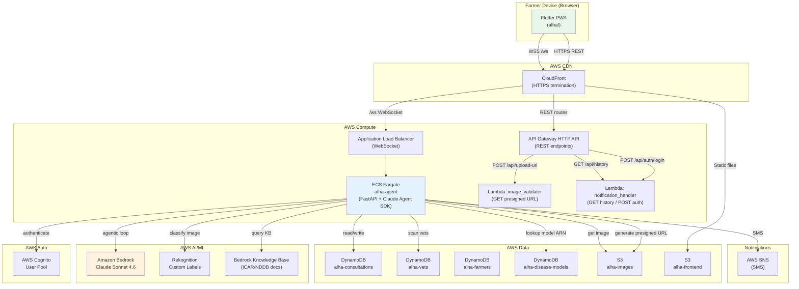
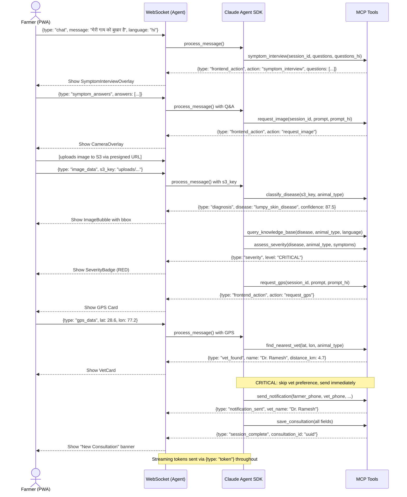

# System Architecture

## Overview

ALHA is a bilingual (Hindi/English) AI-powered veterinary consultation system for Indian farmers. Farmers interact via a Flutter PWA — describing symptoms in text or voice — and receive AI-driven disease diagnosis, treatment guidance, and vet coordination.

---

## High-Level Architecture

---

## Consultation Flow Sequence

---

## Key Design Decisions

### 1. Persistent WebSocket for Agentic Interaction
REST APIs cannot support multi-turn agentic interactions where the agent waits for user input mid-flow (symptom answers, image upload, GPS). A persistent WebSocket allows bidirectional, interruptible communication between the Claude agent and the Flutter UI.

### 2. In-Process MCP Server
Tools are registered as an in-process MCP server (not a separate process) to avoid subprocess IPC latency. This keeps the architecture simple while preserving MCP protocol compatibility.

### 3. Hybrid Serverless Architecture
- **Lambda** handles stateless REST operations (auth, upload URL, history).
- **ECS Fargate** handles the stateful WebSocket agent. Lambda cold starts and 15-minute execution limits make it unsuitable for long-running WebSocket connections.

### 4. Claude Agent SDK with Bedrock
The `query()` streaming API with `stream_input()` (async iterable prompt) keeps stdin open for bidirectional MCP I/O. The subprocess environment inherits ECS IAM credential env vars (`AWS_CONTAINER_CREDENTIALS_RELATIVE_URI`) for seamless Bedrock access without explicit API keys.

### 5. Dual Disease Classification
Rekognition Custom Labels provides fast, specialized detection. Claude vision acts as a double-check. On disagreement, Claude wins (more generalizable). On Rekognition error, Claude is the sole fallback. `REKOGNITION_MOCK=true` bypasses Rekognition entirely for development without Rekognition model ARNs.

### 6. Language Handling
Language is detected per-message from Devanagari Unicode range (`\u0900–\u097F`) in Flutter and tagged via `[language: hi/en]` in every prompt. The system prompt mandates strict language consistency — no mixing within a session.

### 7. CloudFront WebSocket Routing
Chrome blocks mixed-content WebSocket connections (`ws://` from `https://`). CloudFront's `/ws` cache behavior (forward all headers, TTL=0) routes WebSocket to ALB transparently, allowing `wss://` everywhere.

---

## Security Architecture

| Layer | Control |
|-------|---------|
| Authentication | Cognito JWT (RS256) validated against JWKS on every WS connection |
| Authorization | API Gateway Cognito JWT authorizer on all Lambda routes |
| Image access | S3 keys validated: must start with `uploads/`, no path traversal |
| PII in logs | `PIIFilterHook` redacts phone numbers before CloudWatch |
| PII in DB | Vet phone stored as `+91XXXXX{last4}`; farmer phone stored unredacted for GSI but protected by DynamoDB encryption at rest |
| Content safety | Bedrock Guardrails (configurable via `ANTHROPIC_CUSTOM_HEADERS`) |
| Message limits | Chat: 2000 chars; symptom Q: 500 chars; symptom A: 1000 chars |
| Session memory | Max 40 history entries; per-session asyncio locks prevent race conditions |
